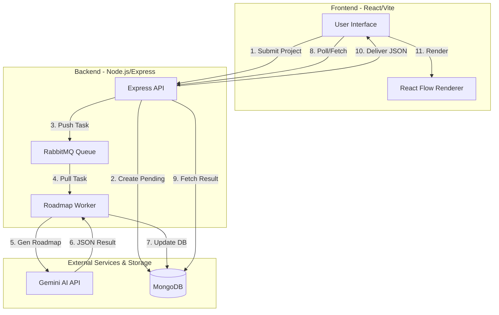
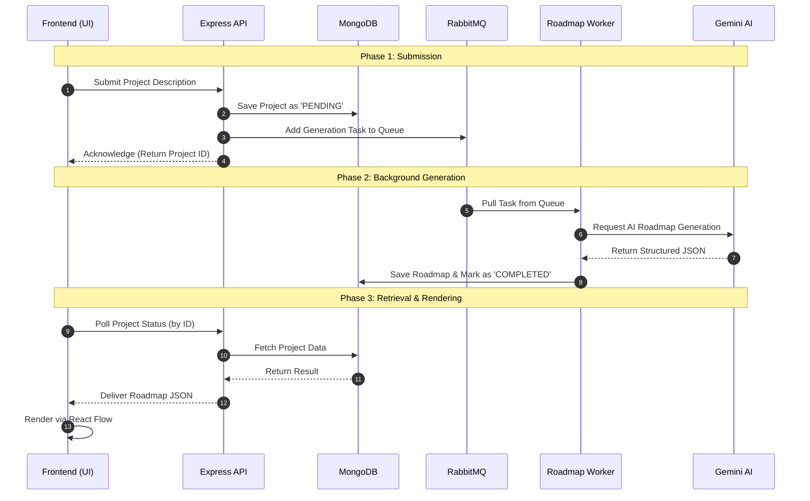

# 🚀 Bluprnt

**Bluprnt** is an AI-powered project planning platform that transforms project descriptions into interactive, visual roadmaps. Using the Gemini API and React Flow, it generates structured JSON roadmaps to help developers visualize their path from idea to execution.

Visit the live app: [🔹BluPrnt🔹](bluprnt.tabishcodes.site/)

---

## 🏗️ System Architecture

A high-level overview of how the components interact across the stack.



---

## 🔄 Process Flow

Detailed step-by-step logic of the roadmap generation lifecycle.



---

## ✨ Features

- ⚙️ **AI Roadmap Generation**: Converts text descriptions into structured roadmaps.
- 🧩 **Interactive Flowcharts**: Visualized using React Flow for easy navigation.
- 📚 **Learning Resources**: Curated materials and code snippets for every node.
- 🚀 **Scalable Worker Architecture**: Uses RabbitMQ for efficient background processing.

---

## 🛠️ Technical Stack

- **Frontend**: React.js, Tailwind CSS, React Flow, Vite.
- **Backend**: Node.js, Express.js, RabbitMQ.
- **Database**: MongoDB (Mongoose).
- **AI Engine**: Google Gemini API.

---

## 🚀 Getting Started

### 1. Prerequisites
- Node.js (v18+)
- MongoDB
- RabbitMQ

### 2. Installation
```bash
git clone git@github.com:m-tabish/Heckers_AMUHACKS4.0.git
cd bluprnt

# Backend Setup
cd backend && npm install

# Frontend Setup
cd ../client && npm install
```

### 3. Environment Setup
Create a `.env` file in `backend/`:
```env
MONGO_CONNECTION_URL=your_mongodb_url
GEMINI_API_KEY=your_gemini_api_key
RABBITMQ_URL=your_rabbitmq_url
```

### 4. Running the App
```bash
# Terminal 1: Start Backend (in backend/)
npm run dev

# Terminal 2: Start Worker (in backend/)
node workers/roadmap.worker.js

# Terminal 3: Start Frontend (in client/)
npm run dev
```

---

## 📧 Contact
Mohd Tabish Khan - [mohdtabishkhan001@gmail.com](mailto:mohdtabishkhan001@gmail.com)
